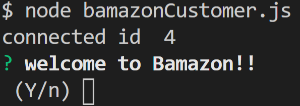

# bamazon
welcome to Bamazon

step 1: choose whether you would like shop or exit

if 'shop': choose the item_id of the merchendise you would like to purchase, 

entering item_id num will prompt user to enter quantity desired

entering quantity will complete purchase if in stock

if out of stock: concole will inform user item is currently out of stock

if 'exit': app ends

continue shopping after purchase with 'shop' or 'exit' to close.

<img =""

